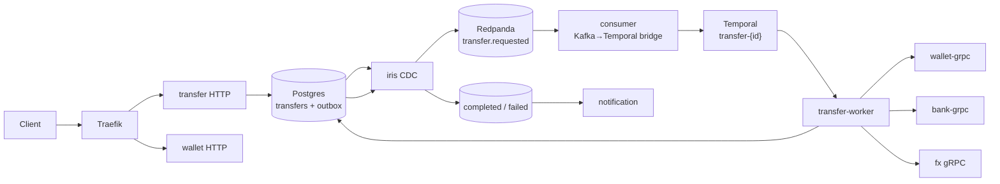

# CLAUDE.md

Guidance for AI agents working in this repository. Keep changes consistent with
the patterns below.

## Project

transx — a wallet transfer system in Go. Product spec: `docs/prd.md`. Each
backend service is a subcommand of one binary (`backend/main.go`, urfave/cli).

## Commands

Run from `backend/`:

```bash
make build          # compile (run after code changes)
make check          # sqlc + format + vet + lint + test + coverage — run before considering work done
make sqlc           # regenerate query code after editing internal/modules/*/infrastructure/query/*.sql
make proto          # regenerate gRPC code after editing proto/*.proto (buf)
make mock           # regenerate mockery mocks into internal/testmocks
make test           # unit tests (go test -short -p 1 ./...)
make test-integration  # tagged integration tests (requires Docker)
make coverage       # module + worker coverage gate (>= 90%)
make migrate        # apply goose migrations
make seed           # insert dev users (idempotent)
go run . --config config.yaml auth            # auth service (ForwardAuth backend)
go run . --config config.yaml wallet          # wallet HTTP API (API only)
go run . --config config.yaml transfer        # transfer HTTP API (API only)
go run . --config config.yaml consumer        # Kafka→Temporal bridge for transfer.requested
go run . --config config.yaml notification    # terminal transfer event notifications
go run . --config config.yaml fx              # FX service (gRPC Quote + QuoteFee)
go run . --config config.yaml wallet-grpc     # Wallet gRPC service (Move/Hold/SettleHold/ReleaseHold)
go run . --config config.yaml bank-grpc       # Bank gRPC service (Submit/Query, mode-driven, stateless)
go run . --config config.yaml transfer-worker # Temporal TransferWorkflow + activities
```

The wallet workload is split across independent commands on the one `transx`
binary so each scales/deploys separately:

- `wallet` — `/accounts` HTTP API only
- `transfer` — `/transfers` HTTP API only (stages `PENDING` + outbox)
- `consumer` — Kafka→Temporal bridge for `transfer.requested` (inbox dedup +
  `StartWorkflow` + start-failure retry tiers); does **not** move money
- `transfer-worker` — Temporal worker: TransferWorkflow + activities (FX, Wallet
  gRPC, Bank gRPC, MarkTerminal)
- `notification` — consumes terminal transfer events and records notification
  audit rows

Outbox events drain to Kafka via the external `iris` CDC service (Postgres
logical replication), which must run single-instance to preserve FIFO ordering.
FX quoting lives in the standalone `fx` service. External payment outcomes come
from `bank-grpc` (mode-driven fake), not an HTTP stub-provider.

`wallet` and `transfer` are two DDD modules (`internal/modules/wallet`,
`internal/modules/transfer`) sharing one Postgres schema and one Go module —
see "Module ownership boundary" below for the table/package split.

Tests live beside the code they cover (`*_test.go`). Unit tests run with
`make test`; integration tests are behind the `integration` build tag
(`make test-integration`, needs Postgres/Kafka via `docker compose`). Mocks are
mockery-generated into `internal/testmocks` (`make mock`). `make check` runs the
full gate (sqlc + format + vet + lint + test + coverage); module and worker
coverage must stay >= 90%.

## Transfer orchestration (Temporal)



- **WorkflowID** = `transfer-{transferID}`; duplicate start = success
  (`AlreadyStarted`).
- **INTERNAL:** prepare (Quote + settlement snapshot) → `Wallet.Move` (atomic
  debit+credit+ledger+fee) → `MarkTerminal(SUCCEEDED|FAILED)`.
- **EXTERNAL:** currency check → `Wallet.Hold` → `Bank.Submit` → SUCCESS
  `SettleHold+MarkTerminal` / FAILURE `ReleaseHold+MarkTerminal` / UNKNOWN keep
  hold + poll `Bank.Query` (no auto-release).
- Money (Wallet) and status (Transfer) are separate transactions; retries
  converge via wallet operation guards + transfer status guards. `MarkTerminal`
  uses a long Temporal retry budget after money has moved.

## Architecture conventions

- **Service runners** live in `cli/` (`runAuth`, `runWallet`, `runTransfer`,
  `runConsumer`, `runNotificationService`, `runFXService`,
  `runWalletGRPCService`, `runBankGRPCService`, `runTransferWorker`). Each
  runner is self-contained: load config → init logger → connect Postgres eagerly
  (if the service needs a DB — Bank does not) → build module wiring → start
  `httpserver`/gRPC and/or workers → block on signal/errgroup. Mirror an
  existing runner.
- **DDD modules** under `internal/modules/<domain>/`:
  - `domain/entities`, `domain/interfaces` — no infra imports.
  - `application/services`, `application/dto` — use cases.
  - `infrastructure/repositories` — implement domain interfaces using sqlc
    `gen/` code; `infrastructure/query/*.sql` is the sqlc source.
- **Shared provider client** lives in `internal/common/provider` (not inside a
  module): wire contract helpers and `FakeProviderClient` (mode-driven
  always_success/always_failure/always_timeout) used by Bank gRPC. The HTTP
  stub-provider path is removed; Bank gRPC is the external payment surface.
- **Worker logic** lives under `cmd/<worker>/`:
  - `cmd/consumer` — Kafka→Temporal bridge for `transfer.requested`
  - `cmd/worker` — TransferWorkflow + activities for `transfer-worker`
  These are orchestration loops, not domain adapters, so they sit beside
  `cmd/api` rather than inside a module. They import a module's
  `domain/interfaces` and are wired up by the matching `cli/` runner.
- **gRPC handlers** live under `cmd/grpc/`:
  - `fx_grpc_handler.go` — FX server adapter. Transfer worker reaches it through
    the transfer FX gRPC client adapter implementing `FXService`.
  - `wallet_grpc_handler.go` — adapts `interfaces.MoneyRepository` to
    `WalletService` (Move/Hold/SettleHold/ReleaseHold). Every RPC carries
    `transfer_id` + `operation`; idempotency is enforced by
    `PostgresMoneyRepository` checking/writing a `wallet_operation_guards` row
    `(transfer_id, operation)` inside the same transaction as the money
    movement.
  - `bank_grpc_handler.go` — Bank server adapter (stateless, mode-driven
    Submit/Query via `FakeProviderClient`).
  - Money/rate values cross the wire as decimal strings, never float/double.
- **Protos** live in `proto/`; `make proto` (buf) regenerates Go code into
  `internal/platform/grpc/gen/`. Reuse `platform/grpc.Serve` to run a server;
  do not hand-roll the gRPC lifecycle.
- **Platform** (`internal/platform/`) is shared infra: `config`, `postgres`,
  `kafka`, `httpserver` (Fiber, serves `/healthz` + `/readyz`), `grpc`, `logger`,
  `middleware`. Reuse it; do not hand-roll HTTP or gRPC servers.
- **HTTP routes** register in `cmd/api/routes.go` via the oaswrap spec router so
  they appear in the exported OpenAPI spec. Handlers in `cmd/api/handlers/`.
  Errors return `*apperror.AppError` (carries HTTP status); `DomainErrorHandler`
  maps them.

## Module ownership boundary

`wallet` and `transfer` are separate DDD packages inside the same Go module
and the same Postgres `public` schema:

- `internal/modules/wallet/...` owns `accounts` and `ledger_entries` (balances
  and holds), plus `wallet_operation_guards` (the `(transfer_id, operation)`
  idempotency guard for the Wallet gRPC service — see `PostgresMoneyRepository`).
- `internal/modules/transfer/...` owns `transfers` and `outbox_events` (plus
  `inbox_events` for consumer/notification dedup, held here temporarily until a
  future gRPC/service split moves inbox ownership).

A package only calls its own `infrastructure/gen` (sqlc) queries directly.
`transfer` reads wallet's `AccountRepository` (`domain/interfaces`) to
authorize a transfer's source/destination accounts and to look up a
beneficiary — a read-only cross-module dependency, not a write. There is no
lint rule enforcing this (no golangci-lint config is tracked in this repo);
the boundary is enforced by convention and code review, so keep new code on
the right side of it and flag any new cross-module import in review.

**Primary money path is Temporal + Wallet gRPC** (no cross-module wallet writes
from the worker). The older
`PostgresTransferRepository.ExecuteInternalTransfer` /
`ReserveExternalTransfer` / `SettleExternalTransfer` helpers still exist as
in-process single-tx implementations (and tests); they are not on the live
Kafka→Temporal path. A future cleanup can remove them once integration proves
Temporal-only production traffic.

## Rules

- **IDs are UUID v7.** DB columns default to `uuidv7()` (Postgres 18); let the
  DB assign them. Don't hardcode IDs in seeds.
- **FX fees** are a flat amount per source currency in config (`fx.fees`, keyed
  by source currency code), charged on internal transfers that convert out of the
  source currency as a third `FEE` ledger entry. A missing/non-positive entry =
  no fee. Not a percentage; don't reintroduce a rate-based fee.
- **Config**: add fields to `internal/platform/config/config.go`. Env override
  format is `SECTION__KEY` (e.g. `AUTH__JWT_SECRET`, `TEMPORAL__HOST_PORT`).
  Secrets stay in `.env` / env vars, never committed.
- **sqlc**: after changing a migration schema or `query/*.sql`, run `make sqlc`.
  A module's sqlc block stays commented in `sqlc.yaml` until its `query/*.sql`
  exists (sqlc fails on empty query globs).
- **Migrations** are goose files in `db/migrations/`. Keep seed data out of
  migrations — use the `seed` command.
- Match the surrounding code's style. Run `make check` before finishing.
- Code comments explain _why_, not plan/phase references.
