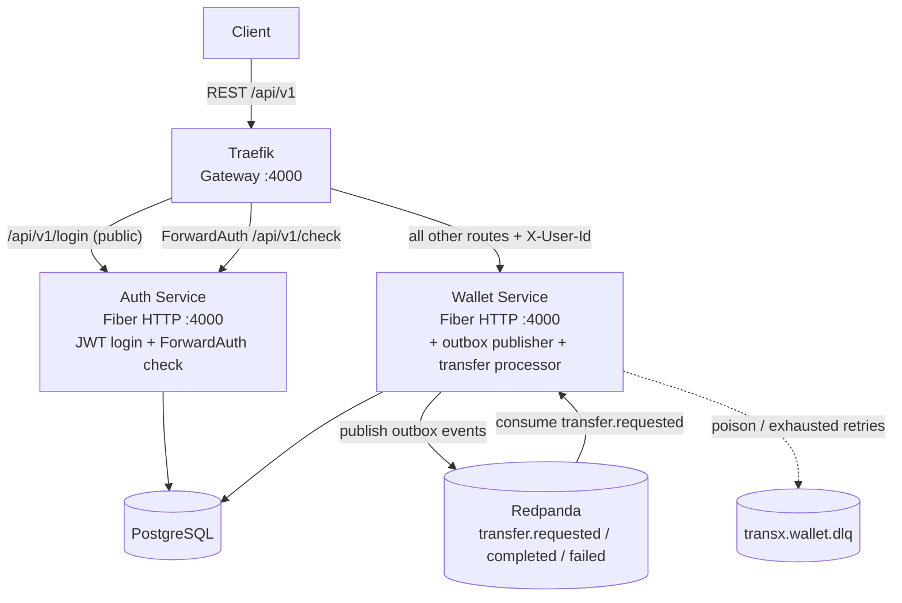
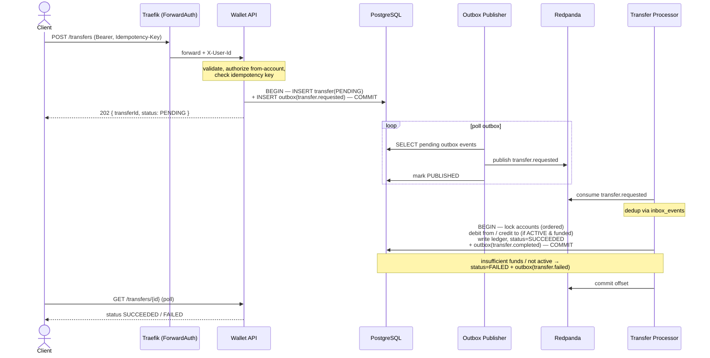
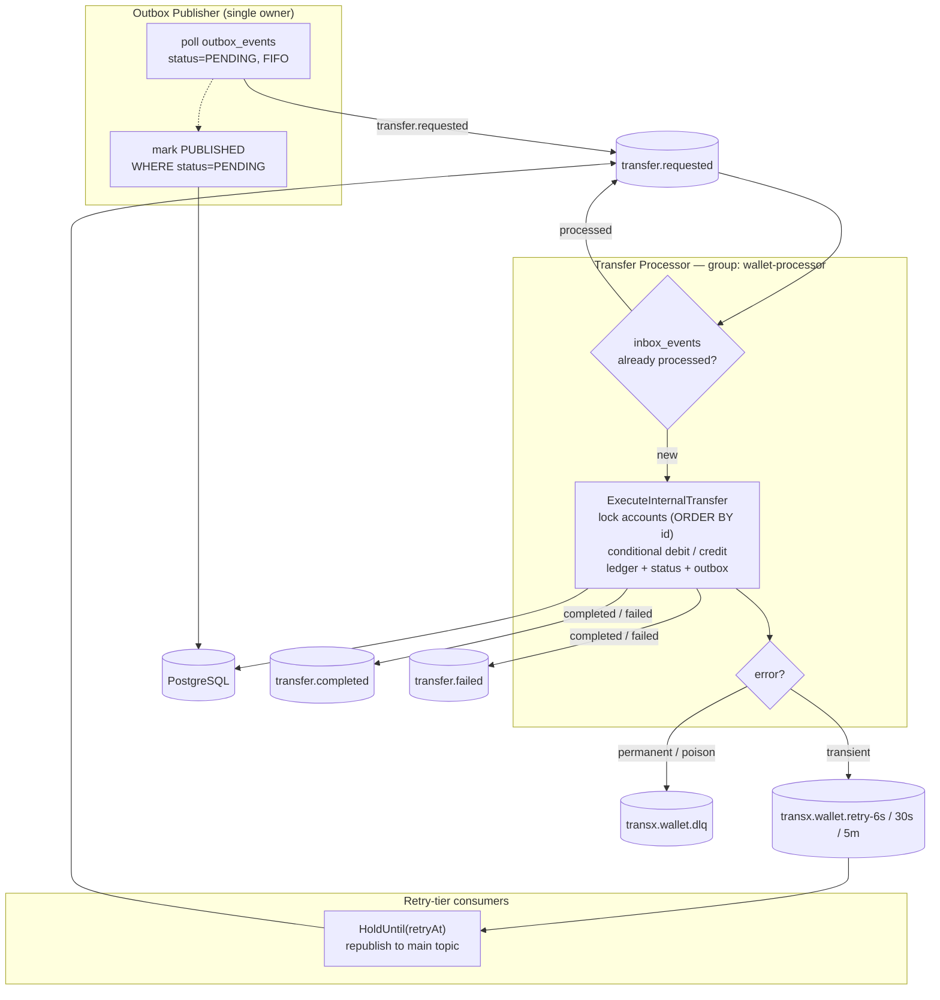
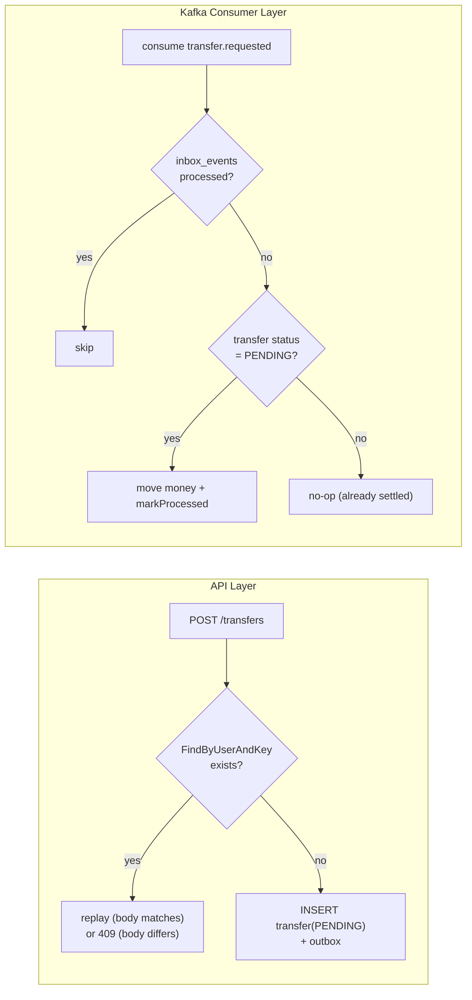

# transx

Wallet transfer system in Go — internal/external money transfers with an
auditable accounting ledger, event-driven processing, idempotent APIs, and
eventually consistent external settlement. See [`docs/prd.md`](docs/prd.md) for
the full product spec.

## Table of Contents

- [Tech Stack](#tech-stack)
- [Repository Structure](#repository-structure)
- [Quick Start](#quick-start)
- [Backend CLI](#backend-cli)
- [Common Commands](#common-commands)
- [Overview Architecture](#overview-architecture)
- [Wallet API](#wallet-api)
- [Internal Transfer Flow](#internal-transfer-flow)
- [Worker Consumer Flow](#worker-consumer-flow)
- [Idempotency](#idempotency)
- [Backend Architecture](#backend-architecture)
- [Key Docs](#key-docs)

## Tech Stack

| Concern        | Choice                                  |
| -------------- | --------------------------------------- |
| Language       | Go 1.26                                 |
| Database       | PostgreSQL 18 (native `uuidv7()`)       |
| Messaging      | Redpanda (Kafka API compatible)         |
| Gateway        | Traefik + ForwardAuth                   |
| HTTP framework | Fiber v2                                |
| DB access      | pgx v5 + sqlc-generated queries         |
| Migrations     | goose                                   |
| Config         | viper + `.env` (env override: `A__B`)   |

All identifiers use **UUID v7** (time-ordered, index-friendly).

## Repository Structure

```
backend/
├── main.go                 # urfave/cli entrypoint; one subcommand per service
├── cli/                    # service runners (auth, wallet), migrate, seed
├── cmd/
│   ├── api/                # HTTP handlers + OpenAPI route registration
│   └── shared/             # OpenAPI router factory
├── internal/
│   ├── modules/<domain>/   # DDD per module: domain / application / infrastructure
│   ├── platform/           # config, postgres, kafka, httpserver, logger, middleware
│   ├── common/             # apperror, kafkatopic
│   └── shared/             # lifecycle, pgconv
└── db/migrations/          # goose SQL migrations
docs/                       # product spec (prd.md)
plans/                      # planning artifacts and implementation phases
```

Each module under `internal/modules/<domain>/` follows a DDD split:

- `domain/` — entities and repository interfaces (no infra dependencies)
- `application/` — services (use cases) and DTOs
- `infrastructure/` — sqlc `gen/` code, `query/*.sql`, repository implementations

## Quick Start

Requires Go 1.26, Docker, and (for codegen) `sqlc` + `goose`.

### 1. Start infrastructure

```bash
docker compose up -d postgres redpanda   # Postgres + Redpanda (Kafka API)
```

Backend containers mount these local files read-only in Docker Compose:

- `backend/config.yaml` → `/app/config.yaml`
- `backend/.env` → `/app/.env`

This lets `auth` and `wallet` share the same local config and secrets while
still supporting env overrides like `POSTGRES__DATABASE_URL` and
`KAFKA__BROKERS`.

### 2. Apply migrations and seed dev data

```bash
cd backend
make migrate
make seed          # alice/bob/carol/dave/eve @transx.dev (password: password123)
                   # + wallet accounts for alice/bob (USD)
```

### 3. Run a service

```bash
make run-wallet                       # wallet: HTTP API + outbox publisher + transfer processor
go run . --config config.yaml auth    # auth service (ForwardAuth backend)
```

The wallet service needs Redpanda up — Kafka is a hard dependency and the
process fails fast at startup if the brokers or topics are missing.

### Full stack via Compose

```bash
docker compose up -d        # traefik + auth + wallet + postgres + redpanda
```

A Traefik gateway fronts the backend on `http://localhost:4000`. Login is
public; all other routes are gated by ForwardAuth, which verifies the bearer
token and injects `X-User-Id` onto the upstream request.

```bash
# Login (public)
curl -X POST http://localhost:4000/api/v1/login \
  -H 'Content-Type: application/json' \
  -d '{"email":"alice@transx.dev","password":"password123"}'

# Authenticated request (Traefik verifies the token, injects X-User-Id)
curl http://localhost:4000/api/v1/accounts/<id> -H "Authorization: Bearer <token>"
```

## Backend CLI

```
transx [--config|-c config.yaml] <subcommand>

  auth      Start the auth service (POST /login + ForwardAuth /check)
  wallet    Start the wallet service (HTTP API + outbox publisher + transfer processor)
  seed      Insert development users and wallet accounts (idempotent)
  openapi-export
            Generate the merged OpenAPI spec without starting services
              --output | -o openapi.yaml   (default: openapi.yaml)
  migrate (m)  Database migrations
    up        Apply all pending migrations
    down      Rollback last migration
    status    Show migration status
```

## Common Commands

```bash
# Infrastructure
docker compose up -d postgres redpanda   # start dependencies
docker compose down                       # stop everything

# Run from backend/
make migrate        # apply goose migrations
make seed           # insert dev users + accounts
make run-wallet     # run the wallet service

# Code generation / quality
make sqlc           # regenerate sqlc query code after editing query/*.sql
make openapi        # regenerate openapi.yaml without Docker
make format         # gofmt / goimports / golines / gofumpt
make vet            # go vet ./...
make lint           # golangci-lint (enforces module boundaries via depguard)
make build          # compile the transx binary
make check          # sqlc + format + vet + lint
```

## Overview Architecture



- **Gateway**: Traefik terminates routing and delegates authentication to the
  auth service via ForwardAuth.
- **Auth service**: issues JWTs (`POST /api/v1/login`) and verifies them for the
  gateway (`GET /api/v1/check`), echoing `X-User-Id` to upstream services.
- **Wallet service**: owns accounts, transfers, ledger entries, and the outbox
  (single consistency boundary for all money movement). Internal P2P transfers
  are processed asynchronously: the HTTP API stages a transfer plus an outbox
  event in one transaction, an outbox publisher relays events to Redpanda, and a
  transfer processor consumes them to move money atomically. Both workers run as
  goroutines in the wallet binary.

## Wallet API

All routes are under `/api/v1` and gated by ForwardAuth (the gateway injects
`X-User-Id` after verifying the bearer token).

| Method | Path | Description |
| ------ | ---- | ----------- |
| `POST` | `/accounts` | Create a wallet account for the caller |
| `GET` | `/accounts/{accountId}` | Get an account balance (owner-scoped) |
| `POST` | `/transfers` | Create an internal transfer (idempotent) |
| `GET` | `/transfers/{transferId}` | Get a transfer (owner-scoped) |

`POST /transfers` requires an `Idempotency-Key` header — a client-generated UUID
(uuidv7 recommended). Retrying with the same key replays the original transfer;
reusing it with a different body returns `409`. The transfer is created
`PENDING` and settled asynchronously, so poll `GET /transfers/{id}` for the
final `SUCCEEDED`/`FAILED` status.

```bash
curl -X POST http://localhost:4000/api/v1/transfers \
  -H "Authorization: Bearer <token>" \
  -H 'Idempotency-Key: 0190bf3e-...' \
  -H 'Content-Type: application/json' \
  -d '{"fromAccountId":"<a>","toAccountId":"<b>","amount":"100","currency":"USD","transferType":"INTERNAL"}'
```

Authorization is P2P: the `fromAccountId` must belong to the caller (otherwise
`403`); the destination may be anyone's. Reads are owner-scoped — another user's
account or transfer returns `404`. The full request/response schema is in the
generated `openapi.yaml` (`make openapi`).

## Internal Transfer Flow



## Worker Consumer Flow

Two background workers run as goroutines in the wallet binary, supervised by an
errgroup so a fatal worker error brings the process down for a clean restart.



- **Outbox publisher** drains `outbox_events` in FIFO order and marks each
  `PUBLISHED` only after a successful publish (`WHERE status='PENDING'` guards
  against double-marking). A single publisher owns the table.
- **Transfer processor** deduplicates via `inbox_events`, then moves money in one
  transaction: it locks both accounts in a deterministic order (avoids cross
  deadlock), runs a conditional debit (`available_balance >= amount AND
  status='ACTIVE'`) and credit, writes the ledger, advances status, and stages
  the completion event — all atomically.
- **Retries**: transient failures (serialization, deadlock) escalate through
  delayed-retry tiers (`6s` → `30s` → `5m`); poison messages and exhausted
  retries go to `transx.wallet.dlq`, so one bad message never wedges the
  partition.

## Idempotency

Two independent layers protect against duplicate money movement:

| Layer | Mechanism | Location |
|---|---|---|
| **API** | Unique index `(user_id, idempotency_key)` + `request_hash` — same key & body replays the original transfer, different body returns `409` | `wallet/application/services/transfer_service.go` |
| **Kafka consumer** | `inbox_events` keyed on `(consumer_group, message_key)` — a redelivered message is skipped; the `status='PENDING'` guard inside the transfer transaction is the final double-credit defense | `wallet/infrastructure/processor`, `wallet/infrastructure/repositories` |



## Backend Architecture

Clean architecture by domain module:

```
internal/
├── modules/
│   ├── auth/       POST /login, ForwardAuth /check (JWT)
│   └── wallet/     accounts, transfers, ledger, outbox + transfer processor
├── platform/
│   ├── config/     viper YAML config (env override SECTION__KEY)
│   ├── postgres/   pgxpool connection + WithTx helper
│   ├── kafka/      Producer + Consumer (manual commit, delayed-retry holds)
│   ├── httpserver/ Fiber server (/healthz, /readyz) + struct validator
│   ├── logger/     structured slog with color support
│   └── middleware/ RequestID, UserID (X-User-Id from ForwardAuth)
├── common/
│   ├── apperror/   AppError (carries HTTP status)
│   └── kafkatopic/ topic names, event types, retry-tier definitions
└── shared/         lifecycle, pgconv
cmd/
├── api/handlers/   HTTP handlers (transport layer)
├── api/routes.go   RegisterRoutes (auth) / RegisterWalletRoutes / RegisterAllRoutesForSpec
└── shared/         OpenAPI-aware route generator
cli/                CLI entry points (auth | wallet | seed | migrate | openapi-export)
```

Modules use `application/dto` for transport-facing commands and responses,
`application/services` for business logic, `domain/entities` for
transport-agnostic domain objects, and `domain/interfaces` for ports and
repositories. Infrastructure implements those interfaces over sqlc-generated
queries.

Each service registers only its own routes — auth runs `RegisterRoutes`, wallet
runs `RegisterWalletRoutes` — so neither binary carries the other's handlers.
The OpenAPI exporter combines both groups with nil handlers
(`RegisterAllRoutesForSpec`) into a single merged `openapi.yaml`.

Conventions:

- **IDs are UUID v7** — DB columns default to `uuidv7()` (Postgres 18); let the
  DB assign them.
- **Money is `decimal.Decimal`** mapped to `NUMERIC(20,4)`; never floats.
- **Errors** return `*apperror.AppError` (carries HTTP status); `DomainErrorHandler`
  maps them to responses.
- **Config**: add fields to `internal/platform/config/config.go`; env override
  format is `SECTION__KEY` (e.g. `AUTH__JWT_SECRET`). Secrets stay in `.env`.

## Key Docs

- Product requirements: `docs/prd.md`
- OpenAPI spec: `backend/openapi.yaml`
```
