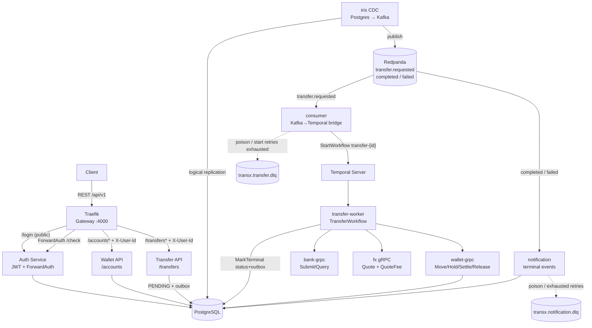
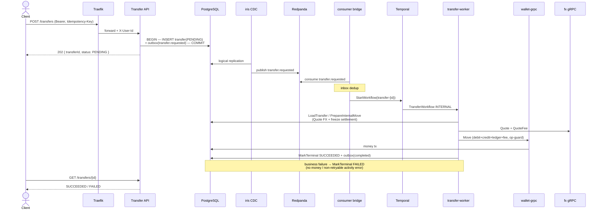
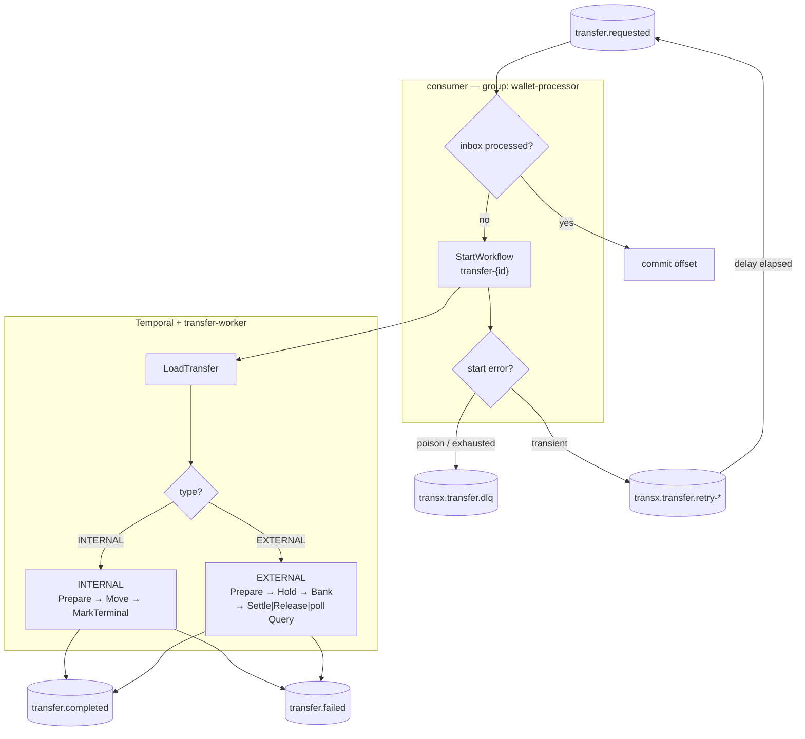
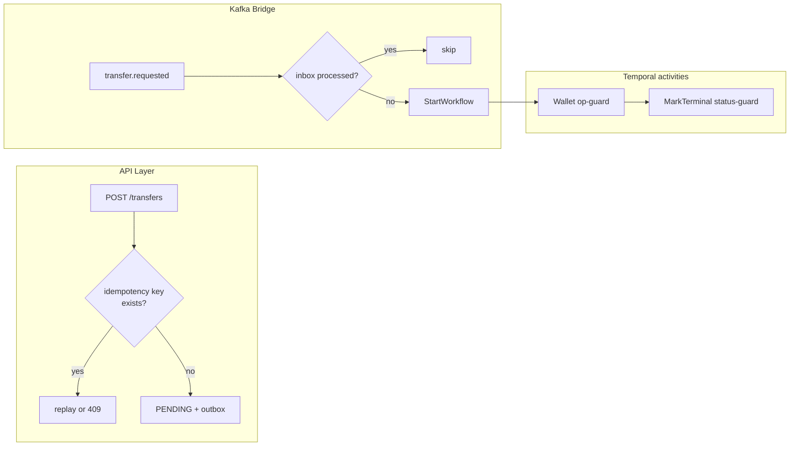

# transx

Wallet transfer system in Go — internal/external money transfers with an
auditable accounting ledger, Temporal saga orchestration, idempotent APIs, and
eventually consistent external settlement. See [`docs/prd.md`](docs/prd.md) for
the full product spec.

## Table of Contents

- [transx](#transx)
  - [Table of Contents](#table-of-contents)
  - [Tech Stack](#tech-stack)
  - [Repository Structure](#repository-structure)
  - [Quick Start](#quick-start)
    - [1. Start infrastructure](#1-start-infrastructure)
    - [2. Apply migrations and seed dev data](#2-apply-migrations-and-seed-dev-data)
    - [3. Run a service](#3-run-a-service)
    - [Full stack via Compose](#full-stack-via-compose)
  - [Backend CLI](#backend-cli)
  - [Common Commands](#common-commands)
  - [Overview Architecture](#overview-architecture)
  - [Wallet API](#wallet-api)
  - [Internal Transfer Flow](#internal-transfer-flow)
  - [External Transfer Flow](#external-transfer-flow)
  - [Multi-Currency & FX Settlement](#multi-currency--fx-settlement)
  - [Worker / Temporal Flow](#worker--temporal-flow)
  - [Idempotency](#idempotency)
  - [Backend Architecture](#backend-architecture)
  - [Key Docs](#key-docs)

## Tech Stack

| Concern        | Choice                                      |
| -------------- | ------------------------------------------- |
| Language       | Go 1.26                                     |
| Database       | PostgreSQL 18 (native `uuidv7()`)           |
| Messaging      | Redpanda (Kafka API compatible)             |
| Orchestration  | Temporal (TransferWorkflow saga)            |
| Gateway        | Traefik + ForwardAuth                       |
| HTTP framework | Fiber v2                                    |
| DB access      | pgx v5 + sqlc-generated queries             |
| Migrations     | goose                                       |
| External bank  | Bank gRPC (mode-driven fake)                |
| FX             | standalone gRPC service (buf-generated)     |
| Config         | viper + `.env` (env override: `A__B`)       |

All identifiers use **UUID v7** (time-ordered, index-friendly).

## Repository Structure

```
backend/
├── main.go                 # urfave/cli entrypoint; one subcommand per service
├── cli/                    # service runners (auth, wallet, transfer, consumer,
│                           #   notification, fx, wallet-grpc, bank-grpc,
│                           #   transfer-worker), migrate, seed
├── proto/                  # gRPC service definitions (buf source)
├── cmd/
│   ├── api/                # HTTP handlers + OpenAPI route registration
│   ├── consumer/           # Kafka→Temporal bridge for transfer.requested
│   ├── worker/             # TransferWorkflow + Temporal activities
│   ├── grpc/               # gRPC handler adapters (fx, wallet, bank)
│   └── shared/             # OpenAPI router factory
├── internal/
│   ├── modules/<domain>/   # DDD per module: domain / application / infrastructure
│   ├── platform/           # config, postgres, kafka, httpserver, grpc, logger, middleware
│   ├── common/             # apperror, kafkatopic, provider (Bank fake)
│   └── shared/             # lifecycle, pgconv
└── db/migrations/          # goose SQL migrations
docs/                       # product + architecture docs
plans/                      # planning artifacts and implementation phases
```

Each module under `internal/modules/<domain>/` follows a DDD split:

- `domain/` — entities and repository interfaces (no infra dependencies)
- `application/` — services (use cases) and DTOs
- `infrastructure/` — sqlc `gen/` code, `query/*.sql`, repository implementations

## Quick Start

Requires Go 1.26, Docker, and (for codegen) `sqlc` + `goose`.

### 1. Start infrastructure

```bash
docker compose up -d postgres redpanda temporal temporal-postgres
```

Backend containers mount these local files read-only in Docker Compose:

- `backend/config.yaml` → `/app/config.yaml`
- `backend/.env` → `/app/.env`

This lets services share the same local config and secrets while still
supporting env overrides like `POSTGRES__DATABASE_URL`, `KAFKA__BROKERS`, and
`TEMPORAL__HOST_PORT`.

### 2. Apply migrations and seed dev data

```bash
cd backend
make migrate
make seed          # alice/bob/carol/dave/eve @transx.dev (password: password123)
                   # + wallet accounts for alice/bob (USD)
```

### 3. Run a service

The workload is split across independent commands on the one `transx` binary so
each scales and deploys separately:

```bash
make run-wallet            # wallet: HTTP API only
make run-consumer          # consumer: Kafka→Temporal bridge
make run-notification      # notification: terminal transfer events
make run-fx                # fx: Quote + QuoteFee (gRPC)
make run-wallet-grpc       # wallet money RPCs
make run-bank-grpc         # bank Submit/Query (mode-driven)
make run-transfer-worker   # Temporal TransferWorkflow + activities
go run . --config config.yaml auth
go run . --config config.yaml transfer
```

`consumer`, `notification`, and `transfer-worker` need Redpanda/Temporal as
applicable — they fail fast at startup if hard dependencies are missing.
`wallet`/`transfer` (API only) and `auth` do not start workflows themselves.
Outbox events are drained to Kafka via the external `iris` CDC service (Postgres
logical replication, single-instance for FIFO ordering).

External transfers go through **Bank gRPC** (`bank-grpc`), mode-driven via
`BANK__MODE` (`always_success` | `always_failure` | `always_timeout`). The Temporal
worker dials it at `BANK__GRPC_ADDRESS`.

FX quoting lives in the standalone `fx` service (`FX__GRPC_ADDRESS`), dialed by
the transfer worker during prepare activities.

### Full stack via Compose

```bash
docker compose up -d
# traefik + auth + wallet + transfer + consumer + notification + fx
# + wallet-grpc + bank-grpc + transfer-worker + temporal (+ ui)
# + iris + postgres + redpanda
```

A Traefik gateway fronts the backend on `http://localhost:4000`. Login is
public; all other routes are gated by ForwardAuth, which verifies the bearer
token and injects `X-User-Id` onto the upstream request.

```bash
# Login (public)
curl -X POST http://localhost:4000/api/v1/login \
  -H 'Content-Type: application/json' \
  -d '{"email":"alice@transx.dev","password":"password123"}'

# Authenticated request (Traefik verifies the token, injects X-User-Id)
curl http://localhost:4000/api/v1/accounts/<accountRef> -H "Authorization: Bearer <token>"
```

## Backend CLI

```
transx [--config|-c config.yaml] <subcommand>

  auth             Start the auth service (POST /login + ForwardAuth /check)
  wallet           Start the wallet HTTP API (API only)
  transfer         Start the transfer HTTP API (API only)
  consumer         Kafka→Temporal bridge for transfer.requested (+ start retries)
  notification     Consume terminal transfer events and dispatch notifications
  fx               Run the FX service (gRPC Quote + QuoteFee)
  wallet-grpc      Run Wallet gRPC (Move/Hold/SettleHold/ReleaseHold)
  bank-grpc        Run Bank gRPC (Submit/Query, mode-driven)
  transfer-worker  Run Temporal TransferWorkflow + activities
  seed             Insert development users and wallet accounts (idempotent)
  openapi-export   Generate the merged OpenAPI spec without starting services
                     --output | -o openapi.yaml   (default: openapi.yaml)
  migrate (m)      Database migrations
    up             Apply all pending migrations
    down           Rollback last migration
    status         Show migration status
```

## Common Commands

```bash
# Infrastructure
docker compose up -d postgres redpanda temporal temporal-postgres
docker compose down

# Run from backend/
make migrate
make seed
make run-wallet
make run-consumer
make run-notification
make run-fx
make run-wallet-grpc
make run-bank-grpc
make run-transfer-worker

# Code generation / quality
make sqlc
make proto
make mock
make openapi
make format
make vet
make lint
make test
make test-integration
make coverage
make build
make check
```

## Overview Architecture



- **Gateway**: Traefik terminates routing and delegates authentication to auth
  via ForwardAuth.
- **Auth**: issues JWTs and verifies them for the gateway (`X-User-Id`).
- **Transfer API**: stages `PENDING` transfer + `transfer.requested` outbox in
  one transaction; does not move money.
- **iris**: CDC drain of outbox → Redpanda (single-instance FIFO).
- **consumer**: only the Kafka→Temporal bridge (inbox dedup + `ExecuteWorkflow`).
- **transfer-worker**: runs the Temporal saga (INTERNAL/EXTERNAL activities).
- **wallet-grpc / bank-grpc / fx**: money, bank outcomes, and FX quotes over gRPC.
- **notification**: terminal events → notification audit rows.

## Wallet API

All routes are under `/api/v1` and gated by ForwardAuth (the gateway injects
`X-User-Id` after verifying the bearer token).

| Method | Path                      | Description                              |
| ------ | ------------------------- | ---------------------------------------- |
| `POST` | `/accounts`                            | Create a wallet account for the caller               |
| `GET`  | `/accounts`                            | List the caller's accounts (paginated; currency/status filters) |
| `GET`  | `/accounts/{accountRef}`               | Get an account balance (owner-scoped)                |
| `GET`  | `/accounts/{accountType}/{accountRef}` | Look up internal/external beneficiary account info   |
| `POST` | `/transfers`                           | Create a transfer (idempotent)                       |
| `GET`  | `/transfers`                           | List the caller's transfers (paginated; status/accountRef filters) |
| `GET`  | `/transfers/{transferId}`              | Get a transfer (owner-scoped)                        |

`POST /transfers` requires an `Idempotency-Key` header — a client-generated UUID
(uuidv7 recommended). Retrying with the same key replays the original transfer;
reusing it with a different body returns `409`. The transfer is created
`PENDING` and settled asynchronously via Temporal, so poll
`GET /transfers/{id}` for the final `SUCCEEDED`/`FAILED` status.

`transferType` selects the flow. `INTERNAL` (default) moves funds to another
in-ledger account and requires `toAccountRef` (an `ACC-` account ref).
`EXTERNAL` sends funds out through Bank gRPC: `toAccountRef` is an optional
free-text beneficiary id and the `provider` is set from server config — clients
never send it. A `message` is required on every transfer.

`amount`/`currency` are the **transaction intent**. Settlement amounts are
computed server-side from FX rates once the Temporal workflow prepares/moves
money (`sourceAmount`/`destinationAmount`/rates/fee snapshot).

```bash
# Internal P2P transfer
curl -X POST http://localhost:4000/api/v1/transfers \
  -H "Authorization: Bearer <token>" \
  -H 'Idempotency-Key: 0190bf3e-...' \
  -H 'Content-Type: application/json' \
  -d '{"fromAccountRef":"ACC-...","toAccountRef":"ACC-...","amount":"100","currency":"USD","transferType":"INTERNAL","message":"rent"}'

# External transfer (no in-ledger destination)
curl -X POST http://localhost:4000/api/v1/transfers \
  -H "Authorization: Bearer <token>" \
  -H 'Idempotency-Key: 0190bf3f-...' \
  -H 'Content-Type: application/json' \
  -d '{"fromAccountRef":"ACC-...","amount":"100","currency":"USD","transferType":"EXTERNAL","message":"payout"}'
```

Authorization is P2P: the `fromAccountRef` must belong to the caller (otherwise
`403`); the destination may be anyone's. Reads are ownership-scoped by account.
The full request/response schema is in generated `openapi.yaml` (`make openapi`).

## Internal Transfer Flow



## External Transfer Flow

External transfers hold funds first, then settle after Bank responds. UNKNOWN /
timeout keeps the hold and polls `Bank.Query` — no auto-release.

```mermaid
sequenceDiagram
    actor C as Client
    participant API as Transfer API
    participant DB as PostgreSQL
    participant BR as consumer bridge
    participant T as Temporal
    participant W as transfer-worker
    participant WG as wallet-grpc
    participant BG as bank-grpc

    C->>API: POST /transfers (EXTERNAL)
    API->>DB: PENDING + outbox(transfer.requested)
    API-->>C: 202 PENDING

    BR->>T: StartWorkflow(transfer-{id})
    T->>W: TransferWorkflow EXTERNAL
    W->>DB: PrepareExternalHold<br/>(currency == source, snapshot)
    W->>WG: Hold (available→hold, op-guard)
    WG->>DB: hold tx
    W->>BG: Submit(transferId, amount, currency)

    alt SUCCESS
        BG-->>W: SUCCESS + referenceId
        W->>WG: SettleHold
        W->>DB: MarkTerminal SUCCEEDED + outbox(completed)
    else FAILURE
        BG-->>W: FAILURE + reason
        W->>WG: ReleaseHold
        W->>DB: MarkTerminal FAILED + outbox(failed)
    else UNKNOWN / timeout
        BG-->>W: UNKNOWN
        loop poll until known (hold retained)
            W->>BG: Query(transferId)
        end
        Note over W: never auto-release on UNKNOWN<br/>alert after ~15m; recon manual
    end

    C->>API: GET /transfers/{id}
    API-->>C: SUCCEEDED / FAILED / still in-flight
```

## Multi-Currency & FX Settlement

A transfer separates the **transaction intent** (client request) from the
**settlement** (per-account postings in each account's currency). The Temporal
prepare activity quotes via the `fx` service and freezes the settlement snapshot
before money moves.

Rates come from static config (`fx.rates`, keyed `FROM_TO`). Same-currency
corridors quote at rate `1`. Missing corridors fail with `FX_RATE_UNAVAILABLE`
(non-retryable business failure).

A flat **FX conversion fee** (`fx.fees`, keyed by source currency) is charged
when an internal transfer converts out of the source currency (third `FEE`
ledger entry). Missing/non-positive fee = no fee.

```yaml
fx:
  rates:
    VND_USD: '0.00003924'
    USD_VND: '25484.20'
    USD_EUR: '0.92'
    EUR_USD: '1.0870'
  fees:
    USD: '1'
    VND: '10000'
```

### Internal transfers (cross-currency capable)

| Case | Example | Ledger entries (on success) |
| ---- | ------- | --------------------------- |
| Same currency | 100 USD, both accounts USD | `DEBIT 100 USD` + `CREDIT 100 USD` |
| Destination converts | 100 USD → VND @ `25484.20` | `DEBIT 100 USD` + `CREDIT 2548420 VND` |
| Source converts | 10 USD into USD acct from VND + fee | `DEBIT 254842 VND` + `FEE 10000 VND` + `CREDIT 10 USD` |

Cross-currency postings are balanced **per currency**, not by absolute value.

### External transfers (single-currency only)

External transfers do **not** convert. Prepare requires source account currency
== transaction currency (`source_fx_rate = 1`). Mismatch →
`FX_RATE_UNAVAILABLE` before any hold.

| Step / outcome | Ledger entry |
| -------------- | ------------ |
| Hold | `HOLD` |
| Settle success | `DEBIT` (drops hold) |
| Settle failure | `RELEASE` (returns hold to available) |
| UNKNOWN | hold retained |

## Worker / Temporal Flow



- **iris** publishes every outbox `event_type` as a Kafka topic of the same name.
- **consumer** is only the bridge: inbox dedup, Temporal start, delayed-retry
  tiers for transient Temporal/start failures (`transx.transfer.retry-*`), DLQ
  for poison/exhausted starts.
- **transfer-worker** owns money movement and terminal status via activities.
  Wallet operations are idempotent on `(transfer_id, operation)`. MarkTerminal
  is status+outbox only and retries until converge after money has moved.
- **notification** still uses its own inbox + retry/DLQ topics
  (`transx.notification.*`).

## Idempotency

| Layer | Mechanism | Location |
| ----- | --------- | -------- |
| **API** | Unique `(user_id, idempotency_key)` + `request_hash` | transfer application service |
| **Kafka bridge** | `inbox_events` `(wallet-processor, transferId)` before StartWorkflow | `cmd/consumer` |
| **Temporal** | WorkflowID `transfer-{id}` + `AlreadyStarted` = success | consumer + Temporal |
| **Wallet money** | `wallet_operation_guards (transfer_id, operation)` | `PostgresMoneyRepository` |
| **Status** | MarkTerminal no-op when already terminal | transfer repository |



## Backend Architecture

```
internal/
├── modules/
│   ├── auth/         POST /login, ForwardAuth /check (JWT)
│   ├── wallet/       accounts, ledger, money repository (gRPC ops)
│   ├── transfer/     transfers, outbox, inbox, transfer application service
│   ├── fx/           rates + fees
│   └── notification/ terminal event notifications
├── platform/         config, postgres, kafka, httpserver, grpc, logger, middleware
├── common/           apperror, kafkatopic, provider (Bank fake)
└── shared/           lifecycle, pgconv
cmd/
├── api/              HTTP handlers + routes
├── consumer/         Kafka→Temporal bridge
├── worker/           TransferWorkflow + activities
├── grpc/             fx / wallet / bank handlers
└── notification/     terminal consumers
cli/                  service runners
```

Conventions:

- **IDs are UUID v7** — DB defaults to `uuidv7()` (Postgres 18).
- **Money is `decimal.Decimal`** → `NUMERIC(20,4)`; FX rates `NUMERIC(20,12)`.
- **Transaction intent vs settlement** — clients never send rates/settlement amounts.
- **Errors** return `*apperror.AppError`; `DomainErrorHandler` maps HTTP status.
- **Config** env override: `SECTION__KEY` (e.g. `TEMPORAL__HOST_PORT`,
  `BANK__MODE`, `WALLET__GRPC_ADDRESS`).
- **Money never settles across a network call in one tx** — EXTERNAL holds first,
  then settles/releases after Bank; UNKNOWN keeps the hold.

## Key Docs

- Product requirements: `docs/prd.md`
- System architecture: `docs/system-architecture.md`
- OpenAPI spec: `backend/openapi.yaml`
- Temporal saga plan: `plans/260711-2300-temporal-saga-transfer-orchestration/`
