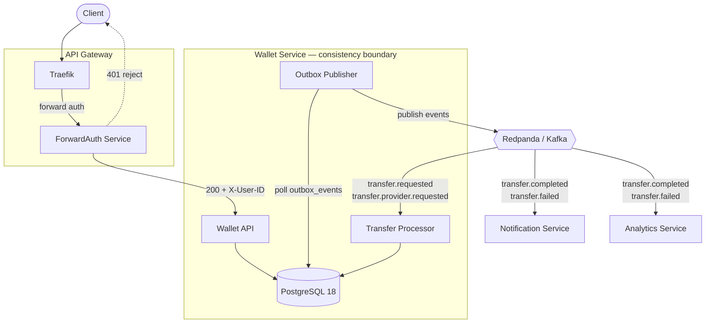

# Wallet Transfer System PRD

**Version:** 1.0 **Target:** 10k Concurrent Users

## Tech Stack

- Go 1.25+
- PostgreSQL 18
- Redis
- Redpanda (Kafka API Compatible)
- Traefik Gateway + ForwardAuth
- Docker / Kubernetes

> **ID strategy:** All identifiers use **UUID v7**. UUID v7 is time-ordered (timestamp in the high bits), which keeps B-tree indexes append-friendly and avoids the write hot-spots of random UUID v4, while still allowing IDs to be generated on the application side in a distributed setup.

---

## 1. Overview

Build a wallet platform that supports:

- Wallet account management
- Internal money transfers
- External transfers via third-party providers
- Auditable accounting ledger
- Event-driven processing
- Idempotent APIs
- Eventually consistent external settlement

> Authentication is already implemented and is outside the scope of this document.

---

## 2. System Goals

### Functional Goals

- Create accounts
- Retrieve balances
- Create transfer requests
- Support internal transfers
- Support external provider transfers
- View transfer history
- View transfer details

### Non-Functional Goals

- 10k CCU
- P99 API latency &lt; 100ms
- Transfer completion &lt; 5s
- No double spending
- No lost transfers
- Horizontal scalability
- Full auditability

---

## 3. Architecture



---

## 4. API Gateway

Traefik performs:

- TLS termination
- Routing
- Rate limiting
- Request ID injection
- Forward Authentication

### Flow

```
Client
  ↓
Traefik
  ↓
ForwardAuth
  ├── 200 → Wallet Service
  └── 401 → Reject Request
```

ForwardAuth injects the following headers, which the Wallet Service trusts:

- `X-User-ID`
- `X-Request-ID`

---

## 5. Services

### Wallet Service

**Responsibilities:**

- Account management
- Balance management
- Transfer management
- Ledger management
- Transfer processing
- Outbox publishing

**Owner of:**

- `accounts`
- `transfers`
- `ledger_entries`
- `outbox_events`

All money movement belongs to one consistency boundary.

### Notification Service

**Responsibilities:**

- Push notifications
- Email notifications

**Consumes:**

- `transfer.completed`
- `transfer.failed`

### Analytics Service

**Responsibilities:**

- Reporting
- BI
- Dashboards

**Consumes:**

- `transfer.completed`
- `transfer.failed`

---

## 6. Domain Models

### Account

Represents a wallet.

| Field            | Type      | Notes              |
| ---------------- | --------- | ------------------ | -------- | -------- |
| accountId        | UUID v7   | Primary identifier |
| userId           | UUID v7   | Owner              |
| name             | string    |                    |
| currency         | string    |                    |
| availableBalance | number    |                    |
| holdBalance      | number    |                    |
| status           | enum      | `ACTIVE`           | `FROZEN` | `CLOSED` |
| createdAt        | timestamp |                    |
| updatedAt        | timestamp |                    |

### Transfer

Represents transfer intent.

| Field               | Type      | Notes              |
| ------------------- | --------- | ------------------ | ---------- |
| transferId          | UUID v7   | Primary identifier |
| fromAccountId       | UUID v7   |                    |
| toAccountId         | UUID v7   |                    |
| amount              | number    |                    |
| currency            | string    |                    |
| transferType        | enum      | `INTERNAL`         | `EXTERNAL` |
| provider            | string    |                    |
| providerReferenceId | string    |                    |
| status              | enum      | See statuses below |
| failureReason       | string    |                    |
| idempotencyKey      | string    |                    |
| createdAt           | timestamp |                    |
| updatedAt           | timestamp |                    |

**Status values:**

`PENDING` · `RESERVED` · `PROCESSING` · `SUBMITTED` · `SUCCEEDED` · `FAILED` · `REVERSED` · `UNKNOWN`

### Ledger Entry

Immutable, append-only accounting records.

| Field         | Type      | Notes              |
| ------------- | --------- | ------------------ | -------- | ------ | --------- |
| ledgerEntryId | UUID v7   | Primary identifier |
| transferId    | UUID v7   |                    |
| accountId     | UUID v7   |                    |
| direction     | enum      | `DEBIT`            | `CREDIT` | `HOLD` | `RELEASE` |
| amount        | number    |                    |
| balanceAfter  | number    |                    |
| createdAt     | timestamp |                    |

---

## 7. Database Tables

### `accounts`

| Column            | Type        | Notes           |
| ----------------- | ----------- | --------------- |
| id                | UUID        | v7, primary key |
| user_id           | UUID        | v7              |
| name              | text        |                 |
| currency          | text        |                 |
| available_balance | numeric     |                 |
| hold_balance      | numeric     |                 |
| status            | text        |                 |
| created_at        | timestamptz |                 |
| updated_at        | timestamptz |                 |

### `transfers`

| Column                | Type        | Notes                |
| --------------------- | ----------- | -------------------- |
| id                    | UUID        | v7, primary key      |
| from_account_id       | UUID        | v7, FK → accounts.id |
| to_account_id         | UUID        | v7, FK → accounts.id |
| amount                | numeric     |                      |
| currency              | text        |                      |
| transfer_type         | text        |                      |
| provider              | text        |                      |
| provider_reference_id | text        |                      |
| status                | text        |                      |
| failure_reason        | text        |                      |
| idempotency_key       | text        |                      |
| created_at            | timestamptz |                      |
| updated_at            | timestamptz |                      |

### `ledger_entries`

| Column        | Type        | Notes                 |
| ------------- | ----------- | --------------------- |
| id            | UUID        | v7, primary key       |
| transfer_id   | UUID        | v7, FK → transfers.id |
| account_id    | UUID        | v7, FK → accounts.id  |
| direction     | text        |                       |
| amount        | numeric     |                       |
| balance_after | numeric     |                       |
| created_at    | timestamptz |                       |

### `outbox_events`

| Column         | Type        | Notes           |
| -------------- | ----------- | --------------- |
| id             | UUID        | v7, primary key |
| aggregate_type | text        |                 |
| aggregate_id   | UUID        | v7              |
| event_type     | text        |                 |
| payload        | jsonb       |                 |
| status         | text        |                 |
| created_at     | timestamptz |                 |
| published_at   | timestamptz |                 |

---

## 8. API Endpoints

### Create Account

`POST /v1/accounts`

**Request**

```json
{
  "name": "Primary Wallet",
  "currency": "USD"
}
```

**Response**

```json
{
  "accountId": "0190b8e1-3a2c-7f4d-8b1a-2c3d4e5f6a7b",
  "status": "ACTIVE"
}
```

### Get Account

`GET /v1/accounts/{accountId}`

**Response**

```json
{
  "accountId": "0190b8e1-3a2c-7f4d-8b1a-2c3d4e5f6a7b",
  "availableBalance": 500,
  "holdBalance": 0,
  "currency": "USD"
}
```

### Create Transfer

`POST /v1/transfers`

**Headers**

- `Idempotency-Key`

**Request**

```json
{
  "fromAccountId": "0190b8e1-3a2c-7f4d-8b1a-2c3d4e5f6a7b",
  "toAccountId": "0190b8e1-4b3d-7a5e-9c2b-3d4e5f6a7b8c",
  "amount": 100,
  "currency": "USD",
  "transferType": "INTERNAL"
}
```

**Response**

```json
{
  "transferId": "0190b8e1-5c4e-7b6f-a03c-4e5f6a7b8c9d",
  "status": "PENDING"
}
```

### Get Transfer

`GET /v1/transfers/{transferId}`

**Response**

```json
{
  "transferId": "0190b8e1-5c4e-7b6f-a03c-4e5f6a7b8c9d",
  "status": "PROCESSING",
  "amount": 100,
  "currency": "USD"
}
```

---

## 9. Internal Transfer Flow

**API request**

```
POST /transfers
  ↓
Insert transfer.status = PENDING
Insert outbox_event: TransferRequested
  ↓
Return transferId
```

**Transfer Processor**

```sql
BEGIN;

UPDATE transfer SET status = 'PROCESSING';

UPDATE accounts
  SET available_balance = available_balance - amount
  WHERE id = fromAccountId
    AND available_balance >= amount;

UPDATE accounts
  SET available_balance = available_balance + amount
  WHERE id = toAccountId;

INSERT debit ledger;
INSERT credit ledger;

UPDATE transfer SET status = 'SUCCEEDED';

INSERT outbox: TransferCompleted;

COMMIT;
```

---

## 10. External Transfer Flow

**API request**

```
POST /transfers
  ↓
Create transfer.status = PENDING
```

**Processor — reserve funds**

```sql
BEGIN;

UPDATE accounts
  SET available_balance = available_balance - amount,
      hold_balance      = hold_balance + amount;

INSERT hold ledger;

UPDATE transfer SET status = 'RESERVED';

INSERT outbox: ProviderTransferRequested;

COMMIT;
```

**Provider Worker** — calls the Provider API.

**Provider success**

```sql
BEGIN;

UPDATE accounts SET hold_balance = hold_balance - amount;

INSERT debit ledger;

UPDATE transfer SET status = 'SUCCEEDED';

COMMIT;
```

**Provider failure**

```sql
BEGIN;

UPDATE accounts
  SET hold_balance      = hold_balance - amount,
      available_balance = available_balance + amount;

INSERT release ledger;

UPDATE transfer SET status = 'FAILED';

COMMIT;
```

---

## 11. Idempotency

Every request requires an `Idempotency-Key`.

Unique index: `(user_id, idempotency_key)`

- Duplicate requests return the existing transfer.
- No duplicate transfers may be created.

---

## 12. Double Spending Protection

Debit operation:

```sql
UPDATE accounts
  SET available_balance = available_balance - amount
  WHERE id = ?
    AND available_balance >= amount;
```

If affected rows `== 0`, the transfer becomes `FAILED` with reason `INSUFFICIENT_FUNDS`.

> Money must never become negative.

---

## 13. Kafka Topics

- `transfer.requested`
- `transfer.provider.requested`
- `transfer.completed`
- `transfer.failed`

---

## 14. Failure Recovery

| Scenario                            | Behavior                                                                      |
| ----------------------------------- | ----------------------------------------------------------------------------- |
| API crashes after creating transfer | Transfer remains `PENDING`; outbox retries publishing                         |
| Kafka duplicates                    | Consumers are idempotent                                                      |
| Processor crashes                   | Database transaction rolls back; no partial money movement                    |
| Provider timeout                    | Transfer becomes `UNKNOWN`; background reconciliation queries provider status |

---

## 15. Future Enhancements

- Scheduled transfers
- Recurring transfers
- Daily limits
- Fraud detection
- AML checks
- Multi-currency support
- Admin reconciliation dashboard
- Ledger snapshots
- Multi-region deployment
